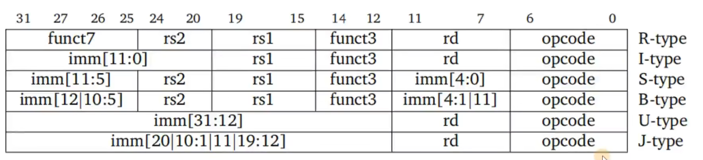

# risc V OS

## 计算机的硬件组成

## risc v ISA

* ISA (Instruction Set Architecture) 指令集架构：定义了计算机的指令集，包括指令的格式、功能、寄存器、内存等

### ISA定义了什么

- 基本数据类型
- 寄存器
- 指令集
- 内存访问方式
- 异常处理
- 中断处理
- I/O

### ISA宽度

- ISA的宽度指的是通用寄存器的位宽，这决定了寻址空间的大小，以及数据运算的能力
- **注意：ISA的宽度和指令编码长度无关**

### riscv ISA的模块化

- riscv ISA的模块化设计，使得可以根据需求选择不同的模块，以适应不同的应用场景
- I 模块：基本整数指令集
- M 模块：乘法和除法指令集
- A 模块：原子指令集
- F 模块：单精度浮点指令集
- D 模块：双精度浮点指令集
- G 模块：通用指令集，包含I、M、A、F、D模块
- C 模块：压缩指令集

### HART

- HART (Hardware Thread)：硬件线程，是处理器的一个实例，包括寄存器、PC、内存等
- hyper-threading：超线程，一个物理处理器模拟出多个逻辑处理器，提高处理器的利用率

### 特权级别

- M 模式：机器模式，最高特权级别，用于操作系统
- R 模式：监管者模式，次高特权级别，用于超级用户
- S 模式：主管者模式，中等特权级别，用于普通用户
- U 模式：用户模式，最低特权级别，用于应用程序

#### CSR

- CSR (Control and Status Register)：控制和状态寄存器，用于控制和监视处理器的状态
- 不同的特权级别分别对应不同的CSR
- 高级别的特权级别可以访问低级别的CSR
- RISC-V定义特定的指令用来在不同特权级别之间切换

#### 内存管理与保护

- 物理内存保护
- 虚拟内存

#### 异常和中断

- 异常：处理器内部的错误，如除零、非法指令等
    - 异常处理过程：保存现场 -> 转移控制权 -> 处理异常 -> 恢复现场，重新执行异常指令
- 中断：外部的事件，如时钟中断、IO中断等
    - 中断处理过程：保存现场 -> 转移控制权 -> 处理中断 -> 恢复现场，继续执行中断后的指令

## risc v 汇编

### 1. 汇编指令

#### 1.1 指令格式

[label:] [operation] [comment]

- label: 标签, 可选，任何以冒号结尾的标识符
- operation: 操作码, 必选
- comment: 注释, 可选，以#开头

#### 1.2 指令类型

- instruction 指令：直接对应机器指令
- pseudo-instruction 伪指令：不直接对应机器指令，由汇编器转换为指令序列，为了方便编程
- directive 指令：不直接对应机器指令，用于指导汇编器的工作
- macro 宏：由一系列指令组成的一个整体，用于简化代码

#### 1.3 指令总览

##### 寄存器

- `x0` - `x31`：通用寄存器(RV32I)
- Hart在执行算术运算时，只能使用通用寄存器，不能直接操作内存
- `pc`：程序计数器

##### 内存

- Hart可以执行寄存器和内存之间的数据传输
- 读写操作使用字节为基本单位进行寻址

#### 1.4 指令格式

- 指令长度：ILEN1 = 32 bits RV32I
- 指令对齐：IALIGN = 32 bits RV32I
    - 32位划分为不同的域
        - opcode: 操作码，用于识别指令类型
        - rd: 目的寄存器
        - rs1: 源寄存器1
        - rs2: 源寄存器2
        - funct3: 功能字段3
        - funct7: 功能字段7
        - imm: 立即数
        - shamt: 移位量
        - csr: 控制和状态寄存器
          

##### 小端序

- RISC-V采用小端序，即低位字节存放在低地址，高位字节存放在高地址
- 例如，0x12345678在内存中的存储顺序为：0x78 0x56 0x34 0x12

#### 1.5 指令集

##### 算术运算指令

###### ADD

| 指令  | 描述 | 语法               | 例子             | 等效C代码        |
|-----|----|------------------|----------------|--------------|
| ADD | 加法 | ADD rd, rs1, rs2 | ADD x1, x2, x3 | x1 = x2 + x3 |
